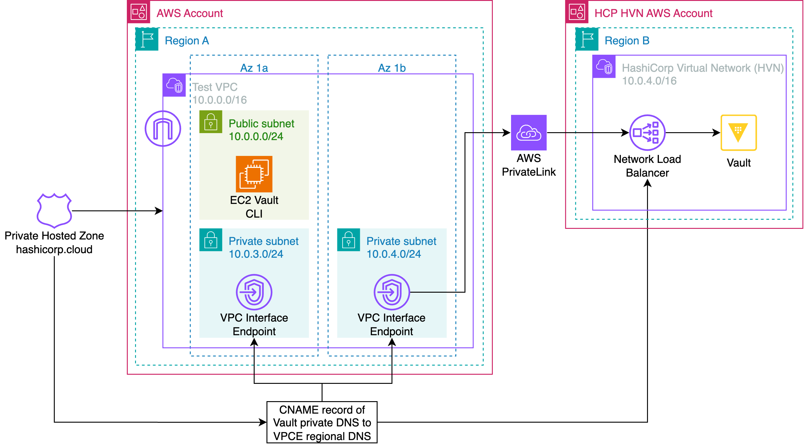
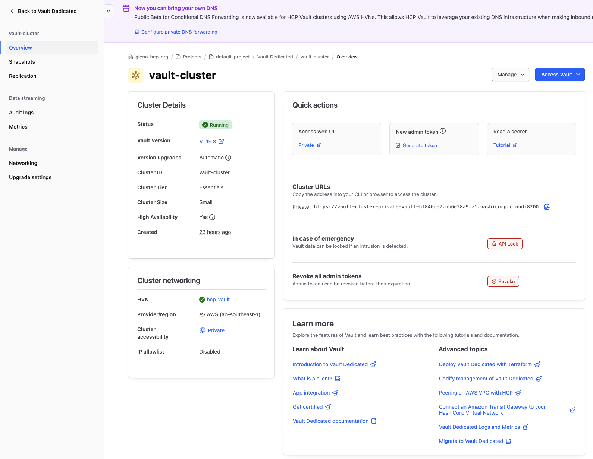
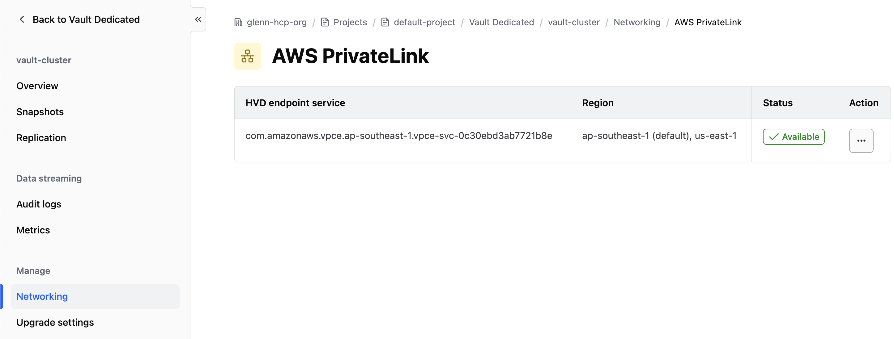
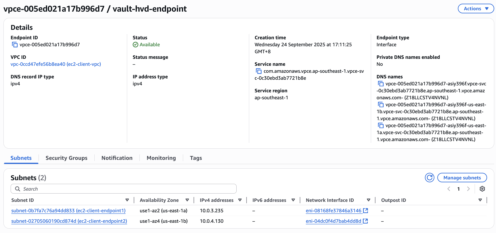
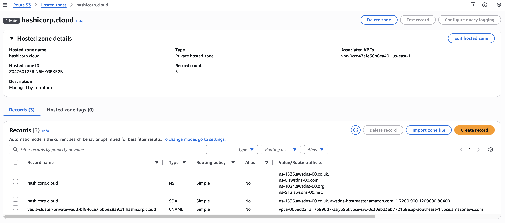
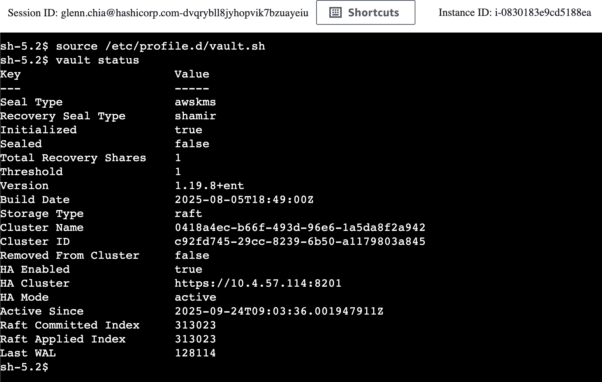
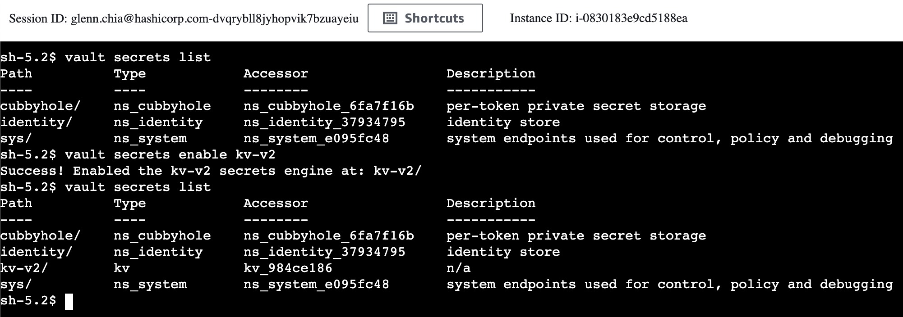

# HCP Vault cross-region connections using AWS PrivateLink

This repository provides demo code on how to establish cross-region connections from consumer VPCs to HCP Vault Dedicated using AWS PrivateLink. It includes Terraform code to deploy the complete infrastructure and all necessary DNS configurations.

# 1. Architecture



# 2. Deployment

Step 1: Configure AWS credentials. For example:

```bash
export AWS_ACCESS_KEY_ID=example
export AWS_SECRET_ACCESS_KEY=example
export AWS_SESSION_TOKEN=example
```

Step 2: Configure HCP credentials. For example:

```bash
export HCP_CLIENT_ID=example
export HCP_CLIENT_SECRET=example
export HCP_PROJECT_ID=example
```

Step 3: In the [tf](./tf) directory, copy [tf/terraform.tfvars.example](./tf/terraform.tfvars.example) to `terraform.tfvars` and change the environment variables accordingly.

Step 4: In the [tf](./tf) directory, run an apply, review the plan output, and approve the plan accordingly.

```bash
terraform init
terraform apply
```

# 3. Verify resources

## 3.1 HCP Vault

HCP Vault overview shows the vault cluster is private



HCP Vault configured with AWS PrivateLink that allows the cross-region, `us-east-1`



## 3.2 Private Link

VPC Interface Endpoint created in the consumer VPC using the service name from HCP Vault endpoint service.



## 3.3 Private Hosted Zone (PHZ)

PHZ created for hashicorp.cloud with a CNAME record pointing HCP Vault's private DNS name to the VPC Interface Endpoint's DNS entry. This is essential for certificate validation that requires the Vault DNS name.



# 4. Testing

Connect to the EC2 instance using [AWS Systems Manager Session Manager](https://docs.aws.amazon.com/systems-manager/latest/userguide/session-manager.html). Then run the following to set the environment variables and get the vault status. This shows that Vault is unsealed.

> [!NOTE]
> Environment variables needed to connect to Vault are pre-loaded into `/etc/profile.d/vault.sh`

```bash
source /etc/profile.d/vault.sh
vault status
```



List current secrets engines, enable KV V2 and list secrets engines again

```bash
vault secrets list
vault secrets enable kv-v2
vault secrets list
```



# 5. Cleanup

In the [tf](./tf) directory, run destroy. Review the destroy output before approving.

```bash
terraform destroy
```
